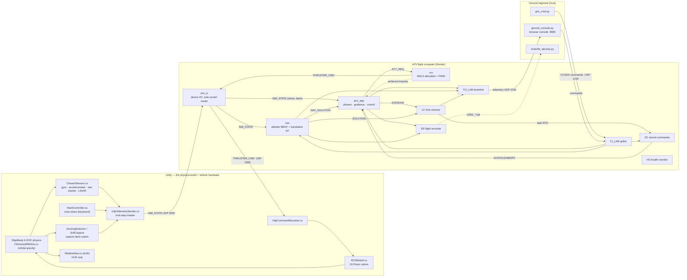
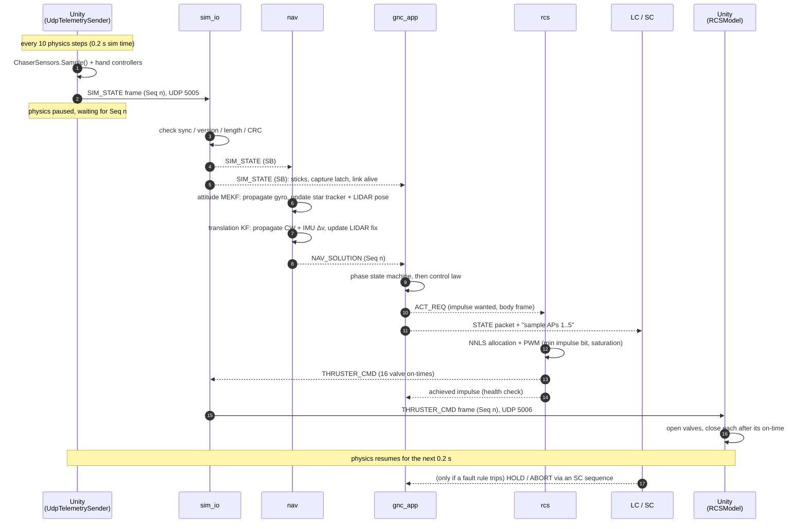
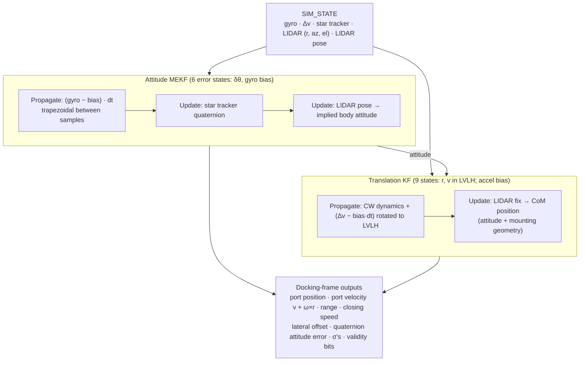
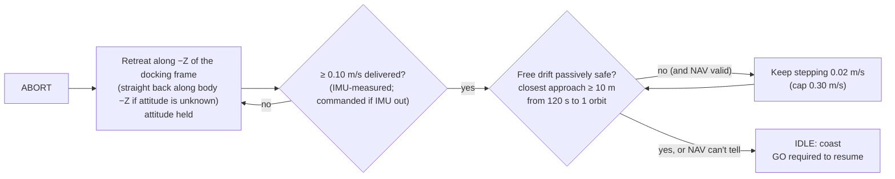
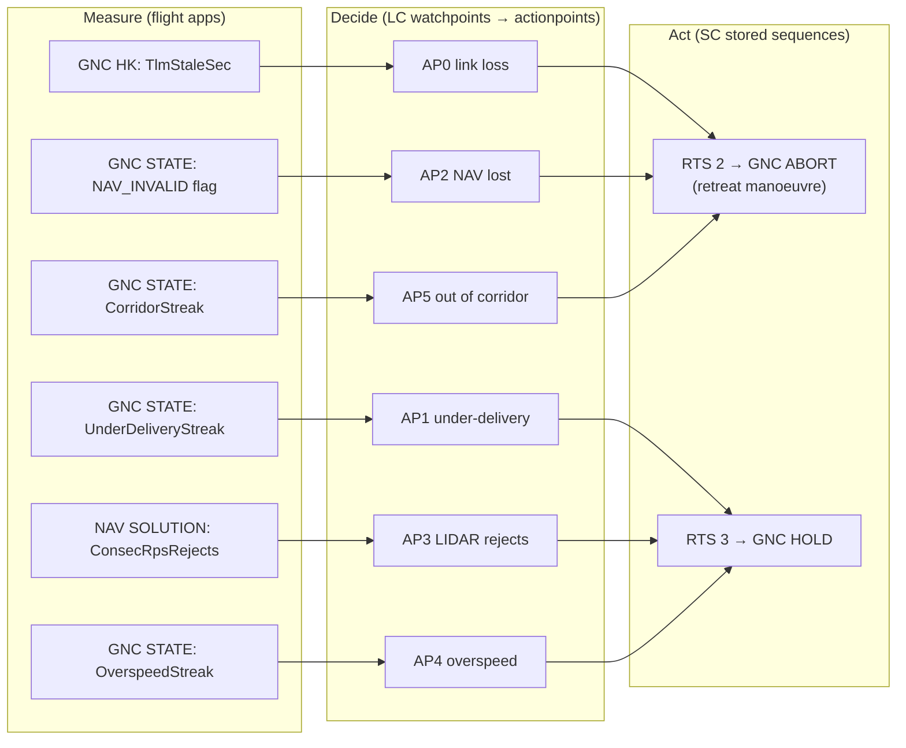
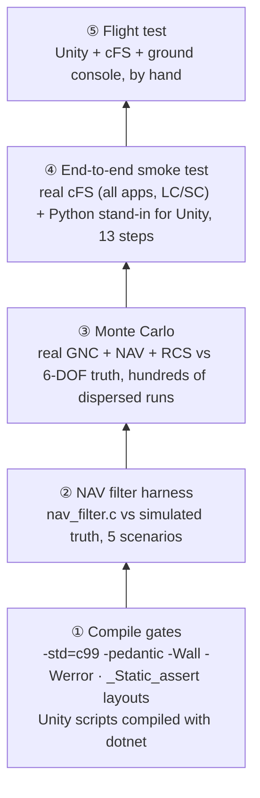
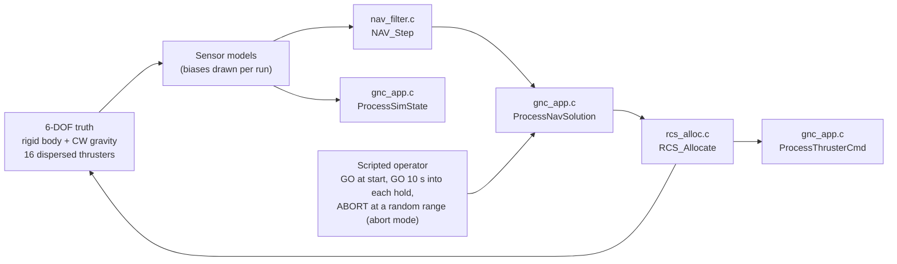
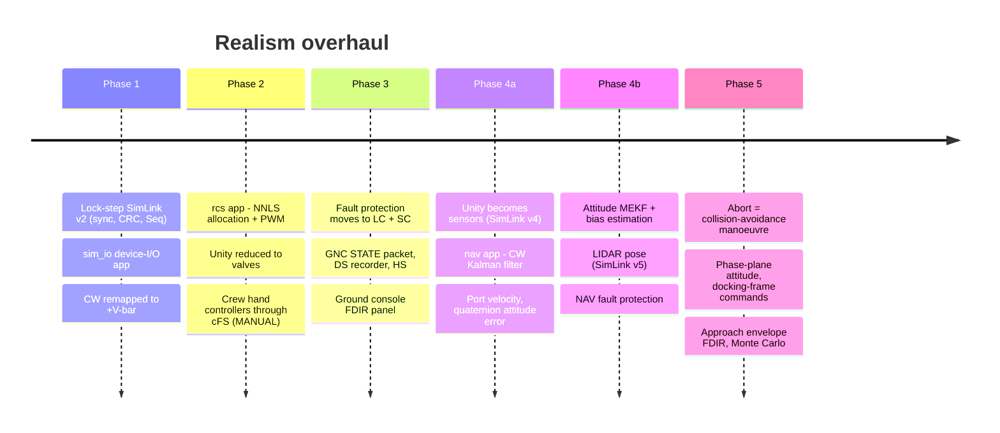

# cFS Docking Simulator: System Overview

*The master guide to what this project is, how its parts fit together, and how each subsystem works, as of the end of realism phase 5 (October 2026).*

This document explains the whole system: the big picture, the design patterns behind it, every major subsystem in detail, how it's tested, and how it got here. For step-by-step instructions on running it, see [Docs/OPERATIONS.md](Docs/OPERATIONS.md). For tuning and "how do I change X" recipes, see [Docs/DEV_REFERENCE.md](Docs/DEV_REFERENCE.md). For the byte-level interface, see [Docs/SIMLINK_ICD.md](Docs/SIMLINK_ICD.md).

---

## Contents

1. [What this project is](#1-what-this-project-is)
2. [The big picture](#2-the-big-picture)
3. [Design patterns](#3-design-patterns)
4. [One control cycle, end to end](#4-one-control-cycle-end-to-end)
5. [Frames and conventions](#5-frames-and-conventions)
6. [SimLink: the Unity ⇄ cFS interface](#6-simlink-the-unity--cfs-interface)
7. [The simulation (Unity)](#7-the-simulation-unity)
8. [The sensors](#8-the-sensors)
9. [Flight software (cFS)](#9-flight-software-cfs)
10. [Fault protection](#10-fault-protection)
11. [Ground segment](#11-ground-segment)
12. [Configuration tables](#12-configuration-tables)
13. [Testing](#13-testing)
14. [How we got here: the realism phases](#14-how-we-got-here-the-realism-phases)
15. [Repository map](#15-repository-map)
16. [Quick start](#16-quick-start)
17. [What's next](#17-whats-next)

---

## 1. What this project is

A spacecraft **rendezvous-and-docking simulator** in which a SpaceX Crew Dragon–style chaser docks to the International Space Station, flown by **real flight software** running on **NASA's Core Flight System (cFS)**.

The project splits the world the way a real spacecraft program does:

| Role | Real program | This project |
|---|---|---|
| The universe (orbits, contact, light) | Reality | **Unity 6** physics: rigid bodies, Clohessy-Wiltshire orbital mechanics, collisions |
| The vehicle hardware (sensors, valves, latches) | Avionics boxes | **Unity scripts** that behave like hardware: `ChaserSensors`, `RCSModel`, `HandController`, `DockingDetector` |
| The flight computer | RTOS + flight software | **cFS** in a Docker container: the custom apps `sim_io`, `nav`, `gnc_app` and `rcs`, plus NASA's LC, SC, DS, HS and others |
| Mission control | Ground system | `ground_console.py` (browser console), `gnc_cmd.py` (command uplink), `tools/fdr_decode.py` (recorder playback) |

The rule that governs everything: **Unity is only the physical world. All decision-making is flight software.** Unity doesn't know where the docking port is from flight software's point of view. It produces noisy sensor readings, and cFS has to work out its own navigation solution, decide what to do, choose thrusters and command valves. It also has to notice when something is wrong. That separation makes this a flight-software project rather than a game.

**Technologies:** C (cFS flight apps), C# (Unity), Python (ground tools and test drivers), NASA cFS/cFE 7 (Draco), Unity 6, Docker/WSL, Blender (vehicle and station models).

---

## 2. The big picture



In words, once every 0.2 s of simulated time:

1. Unity samples its **sensors** and sends one `SIM_STATE` frame, then **stops its physics** and waits.
2. `sim_io` validates the frame and publishes it on the cFS **Software Bus**.
3. `nav` estimates attitude and relative position and velocity, and publishes a `NAV_SOLUTION`.
4. `gnc_app` runs its phase logic and control law, and asks for an impulse (`ACT_REQ`).
5. `rcs` decides which thrusters fire and for how long (`THRUSTER_CMD`).
6. `sim_io` sends those valve on-times back to Unity, which opens the valves and resumes physics.

Around that loop, NASA's standard apps record data (DS), watch for faults (LC), respond to them (SC), check the apps are alive (HS), and talk to the ground (TO_LAB/CI_LAB).

---

## 3. Design patterns

These patterns repeat throughout the codebase. Knowing them makes every part easier to read.

### 3.1 The hardware boundary
Everything Unity sends is something a real sensor or switch could report, and everything cFS sends back is something a real valve driver accepts. Truth never crosses the boundary. Unity's `RelativeNav` still computes exact range and attitude errors, but only for the HUD and the docking mechanism. Flight software has its own estimate, so **the HUD (truth) and the ground console (what flight software believes) are allowed to disagree**, and the gap between them is the navigation error.

### 3.2 One device-I/O app owns the hardware
Only `sim_io` touches sockets, the way a 1553 or SpaceWire driver app does on a real vehicle. Every other app sees ordinary Software Bus messages, so `nav`, `gnc_app` and `rcs` would run unchanged against real avionics.

### 3.3 Publish/subscribe on the Software Bus
Apps never call each other. Each publishes messages with a message ID (MID), and anyone subscribes. Adding the NAV app in phase 4 meant inserting it between `sim_io` and `gnc_app` on the bus. Neither neighbour had to know.

### 3.4 Lock-step on simulation time
cFS is never scheduled by a wall clock for control. **The arrival of a `SIM_STATE` is the clock tick.** Unity holds its physics until the answer comes back, so:
- every run with the same inputs gives the same result (sensor noise is seeded too);
- a slow frame, a breakpoint or a paused editor never desynchronises the two sides;
- the simulation can run faster than real time.

The only wall-clock work is housekeeping at 1 Hz, plus the link-loss watchdog, which has to work precisely when no `SIM_STATE` arrives.

### 3.5 Separate copies of "the truth"
Flight software has its **own** model of the vehicle in configuration tables: thruster geometry (`rcs_thr_tbl.c`), mass and inertia (`gnc_param_tbl.c`), port and sensor mounting (`nav_cfg_tbl.c`). These are deliberately not read from the Unity scene. If the two disagree, that's a realistic modelling error for flight software to cope with, which is exactly what the Monte Carlo disperses. Context-menu generators in Unity print fresh table rows when the scene geometry changes.

### 3.6 Measure → decide → act (fault protection)
Flight apps only **measure** and publish counters, such as a link-silence count or an under-delivery streak. **LC** (Limit Checker) decides when a measurement counts as a fault, and **SC** (Stored Command) acts by sending the same GO/HOLD/ABORT commands an operator would. Fault rules live in tables, so they change without touching flight code.

### 3.7 Table-driven configuration
Every gain, limit, noise figure and geometry value lives in a cFE table (`CFE_TBL`) with a validator. A bad image is rejected and the last good one kept. Tables can be uplinked to a running system.

### 3.8 Packets for data, events for news
Per-cycle state goes out as fixed-layout telemetry packets (GNC `STATE`, `NAV_SOLUTION`), which get recorded and plotted. Events (EVS) are reserved for things that happened: a phase change, a fault, a filter re-initialising. Events are emitted once per transition, never every cycle.

### 3.9 Interfaces are mirrored and size-checked
Every structure that crosses a boundary has `_Static_assert`s on its size, and its mirrors are kept in step: C header ↔ C# struct for SimLink, C header ↔ Python `struct` formats for the ground tools. A layout change that isn't mirrored fails the build, so it can't corrupt data at runtime.

### 3.10 cFE-free cores
The maths of the new apps lives in files with no cFE calls (`nav_filter.c`), or can be compiled with stubs (`gnc_app.c`, `rcs_alloc.c`). That makes it possible to test them directly against simulated truth (see [Testing](#13-testing)).

---

## 4. One control cycle, end to end



The round trip inside cFS typically takes under a millisecond.

---

## 5. Frames and conventions

| Frame | Name | Definition |
|---|---|---|
| **L** | LVLH (local-vertical, local-horizontal) | Unity world axes: **+Y radial** (away from Earth), **−Z along-track** (direction of flight), **+X cross-track** |
| **B** | Body | Chaser axes: +Z toward the docking port, +X right, +Y up; origin at the **centre of mass**. The RCS thruster table uses the same frame |
| **D** | Docking frame | The axes the chaser's port must have at capture: +Z toward the ISS port, X/Y lateral; origin at the ISS port face |
| **S** | Sensor | The LIDAR's own axes, boresight +Z (mounted at the chaser port by default) |
| **T / TP** | Target / target port | ISS body axes, and the ISS docking port's authored axes |

- **Approach geometry.** The chaser starts at −Z of the ISS and closes toward +Z, so it sits on **+V-bar**, ahead of the station, approaching the forward port against the direction of flight. That's the same geometry as a real Dragon approach to IDA-2.
- **Quaternions** are `(x, y, z, w)`. `q_A_B` rotates vectors from frame B into frame A, using the Hamilton product and `v' = q v q*`. These are Unity's own conventions, so Unity and flight software agree with no handedness bookkeeping. The same holds for rigid-body point velocity, `v + ω × r`.
- **The docking roll index.** The ISS port's authored "up" axis points along world −X. The NAV table's `DockedQuat_TP` encodes the correct docked orientation explicitly. Before phase 4 this was a hidden `rollErrorOffset = 90°` fudge.

---

## 6. SimLink: the Unity ⇄ cFS interface

A small binary protocol with real-avionics framing. The full layout is in [Docs/SIMLINK_ICD.md](Docs/SIMLINK_ICD.md).

```
┌──────────────────────── Header (24 B) ─────────────────────────┐┌─ payload ─┐┌─ Trailer (4 B) ─┐
│ Sync 'SLK2' │ Version 5 │ Type │ Seq │ Length │ SimTime_s (f64) ││   ...     ││ CRC-16 │ spare  │
└─────────────────────────────────────────────────────────────────┘└───────────┘└─────────────────┘
```

| Direction | Frame | Port | Payload |
|---|---|---|---|
| Unity → cFS | `SIM_STATE` (type 1) | 5005 | 104 B: raw sensor readings, sensor-valid bits, capture latch, hand controllers |
| cFS → Unity | `THRUSTER_CMD` (type 3) | 5006 | 72 B: GNC phase + 16 valve on-times (s) |

**Integrity.** The receiver drops any frame with a bad sync word, version, type, length or CRC-16/CCITT. It counts the drop and never applies the frame.

**Lock-step engagement.** Unity starts free-running and engages lock-step once cFS has answered the previous cycle. If an answer takes more than 500 ms of real time, Unity logs a warning, drops back to free-running, and re-engages by itself when cFS catches up. Each `THRUSTER_CMD` echoes the `Seq` and `SimTime` it answers, so stale answers are detected and counted.

**Version history:**
- v2 added lock-step and the framing.
- v3 replaced the wrench command with valve on-times and added the hand controllers.
- v4 replaced truth navigation with raw sensors.
- v5 added the LIDAR pose solution.

---

## 7. The simulation (Unity)

Unity plays two roles: **the universe** and **the vehicle's hardware**.

### 7.1 Physics
- **Rigid bodies.** `VehicleState.cs` wraps each Rigidbody. Chaser mass is 12,000 kg. Its inertia is computed from a solid-cylinder model (r = 2 m, l = 6 m): 48,000 kg·m² in pitch and yaw, 24,000 kg·m² in roll. The centre-of-mass override is (0, 0, −4) m in the local frame. Physics steps every 20 ms.
- **Orbital mechanics.** `ClohessyWiltshire.cs` applies the Hill/Clohessy-Wiltshire differential gravity every physics step (mean motion n = 0.00113 rad/s, ISS at about 400 km):
  ```
  a_radial = 3n²·r_radial + 2n·v_along      a_along = −2n·v_radial      a_cross = −n²·r_cross
  ```
  It exposes `LastAccel` so the accelerometer model can subtract gravity, which a real accelerometer can't feel.
- **Thrusters.** `RCSModel.cs` models 16 Draco thrusters (400 N, on/off, no throttling). T00–T03 are aft-facing deorbit thrusters, unused for docking. T04–T07 are the approach group (+Z, canted), T08–T11 brake-yaw and T12–T15 brake-pitch (both −Z, canted outboard). Each valve opens at the start of the GNC cycle and closes after its commanded on-time, resolved within a physics step so the delivered impulse is exact. Every firing produces both force and torque (r × F). Plumes are visual only.
- **Capture.** `DockingDetector.cs` is the soft-capture mechanism. It latches when the port faces are within 5 cm axially, lateral offset ≤ 10 cm, closing speed is between 0 and 0.30 m/s, cone angle ≤ 10° and roll ≤ 10°. `SoftCaptureController` then joins the vehicles, and `DockingContactConstraint` handles the final alignment funnel. The latch state reaches flight software as a mechanism switch bit.

### 7.2 Vehicle hardware scripts
| Script | Hardware it plays |
|---|---|
| `ChaserSensors.cs` | Gyro, accelerometer, star tracker, LIDAR (see [§8](#8-the-sensors)) |
| `RCSModel.cs` | 16 thruster valves |
| `HandController.cs` | Crew translation and rotation hand controllers (keyboard), sent every cycle in `SIM_STATE` |
| `DockingDetector.cs` | Capture-latch switch |
| `UdpTelemetrySender.cs` | The "avionics bus": samples the hardware, sends `SIM_STATE`, runs lock-step |
| `UdpCommandReceiver.cs` | Valve driver: validates `THRUSTER_CMD`, applies on-times |

### 7.3 Simulation-only scripts
- `RelativeNav.cs`: the **truth** relative state, for the HUD, the capture check and the truth log (`TelemetryLogger.cs`).
- `ScenarioReset.cs` (Backspace): teleports the chaser back to its start pose. It tells the sensors not to report the teleport as an acceleration.
- `ThrusterDiagnostic.cs` (F8): a hardware bench test that fires each thruster and compares measured against predicted Δv and Δω.
- UI (UI Toolkit HUD, cameras 1–4, thruster firing diagram, debug panel F3).

### 7.4 Table generators
Right-click context menus print C table rows from the live scene, so flight software's copy can be refreshed after geometry changes:
- `RCSModel` → **Log cFS thruster table** → `rcs_thr_tbl.c`
- `ChaserSensors` → **Log cFS NAV table** (Play mode) → `nav_cfg_tbl.c` geometry rows

---

## 8. The sensors

`ChaserSensors.cs` is added at runtime by `UdpTelemetrySender`, so no scene edits are needed. Each GNC cycle it reads truth from the physics engine and **degrades it the way the real device would**. No stars are photographed and no laser is fired. What matters is the **error model**: noise, bias, field of view, range limits and dropouts, because that's what flight software actually has to cope with. The image processing inside real star trackers and docking LIDARs happens inside the sensor box; they output a quaternion or a position, and that output is what we model.

| Sensor | Real device | Model (truth → reading) | Default error model | Limits |
|---|---|---|---|---|
| **Gyro** | Fibre-optic gyro | Rigidbody angular velocity in body axes, + bias + noise | σ 1e-5 rad/s per sample; bias (1.5, −1.0, 2.0)e-6 rad/s (~0.3–0.4 °/h) | none |
| **Accelerometer** | Proof-mass accelerometer | Velocity change per step **minus CW gravity**, accumulated over the cycle in body axes, + bias·dt + noise | σ 1e-5 m/s per cycle; bias (2.0, −1.5, 3.0)e-5 m/s² (2–3 µg) | senses thrust and contact; free fall reads 0 |
| **Star tracker** | Star camera + catalogue | Body attitude quaternion × small random rotation | σ 5e-5 rad (~10 arcsec) per axis | none |
| **LIDAR range/bearing** | Docking LIDAR on reflectors | Vector from the sensor to the ISS port → range, azimuth = atan2(x, z), elevation = asin(y/r), + noise | range σ 5 mm + 0.1 % of range; angles σ 0.5 mrad | 0.3–250 m, 35° half-angle field of view |
| **LIDAR pose** | Reflector-pattern pose solution | ISS port orientation in the sensor frame × small rotation | σ 3e-3 rad (~0.17°) | inside 30 m |
| **Capture switch** | Latch microswitches | `DockingDetector.isDocked` | none | none |

**Valid bits.** Each reading carries a valid bit in `SensorValid`. Out-of-range LIDAR, or a sensor failed via the Inspector, clears it.

**Fault injection.** Inspector toggles `imuFailed`, `starTrackerFailed` and `rpsFailed` (Play mode) exercise NAV's degraded modes.

**Determinism.** Noise comes from a seeded generator, so lock-stepped runs repeat exactly.

**Two copies of the spec.** The Unity Inspector values are the hardware spec sheet. NAV's table (`nav_cfg_tbl.c`) holds flight software's model of the same sensors, sometimes deliberately conservative (the gyro noise is modelled at 2× to cover integration error during thruster pulses).

---

## 9. Flight software (cFS)

### 9.1 App lineup

| App | Origin | Job |
|---|---|---|
| `sim_io` | this project | Device I/O: UDP ⇄ Software Bus, frame validation, link statistics. Config table: ports and host |
| `nav` | this project (phase 4) | Navigation: attitude MEKF + 9-state translation Kalman filter → `NAV_SOLUTION` |
| `gnc_app` | this project | Phase state machine, guidance, control law, monitors, abort manoeuvre |
| `rcs` | this project (phase 2) | Thruster allocation (NNLS) + pulse-width modulation → valve on-times |
| LC | NASA | Limit Checker: watchpoints + actionpoints = fault detection |
| SC | NASA | Stored Command: relative-time sequences (RTSs) = fault responses |
| DS | NASA | Data Storage: onboard flight-data recorder files |
| HS | NASA | Health & Safety: alerts if a flight app stops running |
| SCH_LAB | NASA sample | 1 Hz housekeeping requests and LC wall-clock sampling (**not** the control cycle) |
| CI_LAB / TO_LAB | NASA sample | Command uplink (UDP 1234) / telemetry downlink (UDP 2234) |

### 9.2 Message map (custom apps)

| MID | Message | Producer → consumers |
|---|---|---|
| 0x0897 | `SIM_IO_SIM_STATE` | sim_io → nav (cycle trigger), gnc_app (sticks, latch, link watchdog) |
| 0x08D1 | `NAV_SOLUTION` | nav → gnc_app (cycle trigger), LC, DS |
| 0x08A2 | `RCS_ACT_REQ` | gnc_app → rcs |
| 0x0898 | `SIM_IO_THRUSTER_CMD` | rcs → sim_io (to Unity), gnc_app (achieved impulse), DS |
| 0x0895 | `GNC_STATE` (per cycle) | gnc_app → TO_LAB, DS, LC |
| 0x0893 / 0x0896 / 0x0899 / 0x08D0 | HK (1 Hz) | gnc_app / sim_io / rcs / nav → TO_LAB, DS, LC |
| 0x1893 / 0x1896 / 0x1899 / 0x18D0 | ground commands | CI_LAB or SC → each app |

### 9.3 `sim_io`: the device-interface app
A child task blocks on the UDP socket, validates frames and publishes `SIM_STATE`. The main task forwards `THRUSTER_CMD` back to Unity. HK counts good frames, bad frames, bad CRCs, sequence gaps, restarts and stale answers.

### 9.4 `nav`: navigation
The estimation maths is in `nav_filter.c`, which has no cFE dependencies. `nav.c` is the cFS shell around it: Software Bus, table, events, telemetry.



**Attitude filter (multiplicative EKF).**
- *State:* the attitude is kept as a quaternion, with a 6-state error vector: small rotation δθ (body) plus gyro bias.
- *Propagation:* the bias-corrected gyro, integrated trapezoidally between this cycle's and the previous cycle's sample.
- *Process noise:* gyro noise on the angle, random walk on the bias.
- *Updates:* the star tracker, and the LIDAR pose. The pose becomes a body-attitude measurement through the known ISS attitude and the port and sensor geometry.
- *Rejection:* every fix passes a chi-square gate (6σ). After 10 consecutive star-tracker rejections the filter re-initialises from the star tracker.
- *Validity:* attitude is **valid** while its 1σ ≤ 0.005 rad. If the star tracker drops out, the gyro (with estimated bias) carries it; a 60 s outage drifts only about 0.003°.

**Translation filter (9-state Kalman filter).**
- *State:* chaser centre-of-mass position and velocity relative to the ISS in LVLH, plus the accelerometer bias in body axes.
- *Propagation:* the closed-form CW transition matrix (third-order series), plus the bias-corrected IMU Δv rotated into LVLH. The Δv is applied as a mid-interval impulse, so position moves by Δv·dt/2.
- *Measurement:* each LIDAR (range, az, el) reading is turned into a CoM position:
  ```
  p_S = range · (cos el · sin az,  sin el,  cos el · cos az)          reflector in sensor frame
  p_B = RpsPos_B + q_B_S · p_S                                       reflector relative to CoM
  z   = q_L_T · TargetPortPos_T − q_L_B · p_B                         CoM relative to ISS
  ```
- *Measurement covariance:* built from the exact Jacobian of p_S(range, az, el), so range noise lies along the true line of sight. An early version put it along the boresight, and the gate then rejected good fixes inside 1 m. It also adds the attitude uncertainty swinging the lever arm.
- *Rejection and recovery:* the same 6σ gate. After **10 consecutive rejections** (for example after a scenario reset teleports the chaser) the filter trusts the sensor and re-initialises.
- *Validity:* relative nav is **valid** while position σ ≤ 0.5 m and velocity σ ≤ 5 mm/s.

**Outputs, in the docking frame D.** Chaser-port position, **port point velocity** (v + ω×r, which matters because the port is 3.9 m from the CoM), range, closing speed, lateral offset, and the **quaternion attitude error** to the docking attitude. Also the measured Δv, σ's, consecutive LIDAR rejections, and the docking-frame quaternion so GNC can rotate its commands.

**Accuracy against truth** (stand-alone harness, converged, with biases on):

| | Value |
|---|---|
| Position | ~3–10 mm |
| Lateral velocity | ~0.1–0.2 mm/s |
| Attitude | ~1e-5 rad |
| Gyro and accelerometer biases | estimated to within ~10–20 % |

### 9.5 `gnc_app`: guidance, navigation-use and control

#### Phases

```mermaid
stateDiagram-v2
    [*] --> IDLE: boot (guidance inhibited)
    IDLE --> CORRECT: GO
    CORRECT --> APPROACH: on axis (< 5 cm), still,<br/>NAV valid, 15 cycles
    APPROACH --> CORRECT: drifts out of 90 % of the cone<br/>or attitude > 6°
    APPROACH --> HOLD: hold point 1 (20 m) / 2 (3 m)<br/>or ground / FDIR HOLD
    HOLD --> CORRECT: GO
    APPROACH --> DOCKED: capture latch switch
    CORRECT --> DEPART: ABORT
    APPROACH --> DEPART: ABORT
    HOLD --> DEPART: ABORT
    DEPART --> IDLE: retreat done +<br/>free drift passively safe
    IDLE --> CORRECT: GO (after abort)
    DOCKED --> [*]
    note right of DEPART: GO and HOLD are refused<br/>until the manoeuvre ends
    note left of IDLE: any undocked phase → MANUAL<br/>on a stick deflection; GO → CORRECT
```


| Phase | What GNC does |
|---|---|
| **IDLE** | Nothing fires. Boot state, and after an abort manoeuvre. |
| **CORRECT** | Holds range (axial station-keep), drives the port onto the docking axis. |
| **APPROACH** | Closes along the axis, holding the centreline. Speed = clamp(0.02 × range, 0.10, cap); cap 0.30 m/s before hold point 1, 0.10 after; never above 90 % of the approach envelope. |
| **HOLD** | Station-keeps at the range where it stopped (position + velocity feedback). Released by GO. |
| **MANUAL** | Crew flies: translation stick = acceleration command; rotation stick = rate command with **rate hold** (released stick → damps to zero). |
| **DEPART** | Abort: collision-avoidance manoeuvre (below). |
| **DOCKED** | Captured. Nothing fires. |

If NAV's relative solution isn't valid (still converging, or LIDAR lost long enough), GNC **coasts in translation**. It holds the phase, the gates wait, and attitude control continues on the star tracker and gyro alone.

#### Control law (per cycle, output = impulse)
GNC asks for an **impulse**, P = m·Δv and L = I·Δω, in body axes. Which thrusters fire is `rcs`'s job.

Translation is worked out in the **docking frame** and rotated to body axes with NAV's attitude:

| Channel | Law |
|---|---|
| Axial (D Z) | Δv = v_target − closing speed (targets per phase above) |
| Lateral (D X, Y) | v_target = clamp(−Kp·offset, ±0.05 m/s); Δv = error beyond a deadband. Kp 0.02 / deadband 0.35 mm/s in CORRECT, Kp 0.03 / deadband 1 mm/s in APPROACH. Velocity is the **port** point velocity. |
| CW feed-forward | The per-cycle gravity-gradient and Coriolis correction (~1e-5 m/s) is **accumulated** per axis and released at one minimum impulse bit (0.7 mm/s), outside any deadband. |
| Attitude (per axis) | **Phase-plane**: beyond the angle deadband (1°, ×0.5 in APPROACH, ×2 in CORRECT), target rate = min(Kp·e, √(2·α·e), 0.02 rad/s) toward zero, where α = 0.01 rad/s² is the planned braking deceleration. Rate errors under 0.0004 rad/s are left alone. Inside the deadband, only drifts faster than 0.003 rad/s are corrected. |

The √(2αe) term is the braking curve: the fastest rate from which the vehicle can still stop on target. That removes overshoot. The deadbands set the size of the classic RCS limit cycle, so it isn't left to chatter on the minimum impulse bit.

#### Monitors (GNC measures; LC decides)
- **Actuator health.** It compares the axial impulse RCS actually commanded last cycle with the Δv the **accelerometer** measured. Under 50 % for several cycles builds `UnderDeliveryStreak`.
- **Approach envelope.** A table of maximum closing speed against range: 0.36 m/s beyond 20 m, tapering to 0.15 m/s inside 10 m. Exceeding it in APPROACH or HOLD builds `OverspeedStreak`.
- **Corridor.** Inside 20 m, being outside the 15° approach cone builds `CorridorStreak`.

#### The abort manoeuvre (DEPART) and passive safety
Real proximity operations never "just stop" near a station. A chaser coasting at 0.1 m/s, or merely drifting under orbital mechanics, can still hit it. Before phase 5, ABORT did exactly that: it cut thrust. The Monte Carlo showed **32 % of aborts hit the station**.

Now ABORT, whether from the ground or from fault protection, starts **DEPART**:



**Passive safety check.** Every cycle, GNC propagates NAV's centre-of-mass state with the **closed-form Clohessy-Wiltshire (Hill) solution**, assuming every thruster stops now and attitude is held. It finds the closest the chaser port would come to the ISS port over the next orbit, and publishes that as `DriftSafeRange_m` (shown on the console's FDIR panel). A posigrade retreat from +V-bar rises and drifts behind the station, so a 0.1 m/s retreat is typically safe by tens of metres.

### 9.6 `rcs`: actuator management
GNC's impulse request becomes valve on-times in two steps:

1. **Allocation: non-negative least squares** (Lawson–Hanson, with a small Tikhonov term) over the enabled thrusters in the table. It solves B·J = [P; L] with J ≥ 0, because thrusters only push. When the request is outside what the thrusters can produce, it returns the closest achievable impulse.
2. **Pulse-width modulation.** On-time = J / 400 N. If any pulse would exceed **0.19 s**, the whole solution is scaled down, which preserves direction. Pulses shorter than the **20 ms minimum impulse bit** round up if they're at least half of it and are dropped otherwise.

`rcs` publishes the on-times plus the **achieved** impulse, so GNC's health check compares against what was really commanded.

---

## 10. Fault protection



| AP | Fault | Trips when | Response |
|---|---|---|---|
| 0 | Sim link loss | No `SIM_STATE` for ≥ 2 s, not docked, not already aborted (sampled at 1 Hz wall clock, ~4 s end to end) | ABORT |
| 1 | Axial thruster under-delivery | Accelerometer sees < 50 % of the predicted Δv for 3 cycles, in APPROACH | HOLD |
| 2 | Navigation lost on approach | NAV relative solution invalid for 10 cycles, in APPROACH | ABORT |
| 3 | LIDAR disagreement | ≥ 5 LIDAR fixes rejected in a row, in APPROACH | HOLD |
| 4 | Approach overspeed | Above the closing-speed envelope for 5 cycles (APPROACH/HOLD) | HOLD |
| 5 | Out of the corridor | Outside the cone inside 20 m for 5 cycles | ABORT |

**Two sampling rate groups.**
- AP0 is sampled by SCH_LAB at 1 Hz of wall-clock time, because it must work while the simulation is silent.
- APs 1–5 are sampled by `gnc_app` at the end of every lock-step cycle, so their persistence counts **simulation cycles**.

**Re-arming.**
- **RTS 1** runs at boot: it turns LC on and enables RTS 2–4.
- After a response fires, its actionpoint goes PASSIVE, so a persisting fault doesn't re-trigger every cycle. **RTS 4** (`gnc_cmd.py rearm`) sets them all ACTIVE again.
- **HS** separately raises an event if any mission app stops running.

---

## 11. Ground segment

### 11.1 Ground console (`ground_console.py`, http://localhost:8080)
A Python server receives TO_LAB telemetry (UDP 2234), decodes the packets, and streams them to a browser page (`console.html`) over server-sent events. Panels:

| Panel | Shows |
|---|---|
| Phase and status | Phase badge, flags, range, closing speed, lateral offset, attitude errors (all from NAV, i.e. what flight software believes) |
| **FDIR** | LC state, each actionpoint ARMED/FIRED and PASS/FAIL, the under-delivery / overspeed / corridor streaks, the predicted free-drift closest approach, abort retreat Δv, and a **RE-ARM** button |
| **NAV** | Relative nav valid/converging, attitude source (star tracker / + LIDAR pose / gyro-only), position, velocity and attitude σ, LIDAR fixes used / rejected / missing, last innovation, filter inits, live **gyro and accelerometer bias estimates** |
| Events | The cFS event log |
| Commands | GO / HOLD / ABORT / NOOP buttons and keyboard shortcuts |

The console also writes every STATE packet to `run_logs/gnc_state_<time>.csv`.

> The console sends the "start telemetry" command to TO_LAB once, at startup. If you start it before cFS, press `t` (Enable TO_LAB TLM).

### 11.2 Commands (`gnc_cmd.py`)
`noop`, `reset`, `go`, `hold`, `abort`, `rearm` (re-arm fault protection), `trace-on` / `trace-off` (per-cycle GNC debug line), `nav-reset` (re-initialise NAV's translation filter).

### 11.3 Flight data recorder
DS writes `/cf/fdr_gnc<seq>.dat` (GNC STATE, NAV solution, valve commands, all housekeeping) and `/cf/fdr_evs<seq>.dat` (every event) next to `core-cpu1`. `tools/fdr_decode.py` turns them into CSVs (`.gnc_state.csv`, `.nav_solution.csv`, `.thruster_cmd.csv`, `.nav_hk.csv`, …) and an events text file.

---

## 12. Configuration tables

| Table | File | Holds |
|---|---|---|
| `GNC_APP.ParamTbl` | `cFS/apps/gnc_app/fsw/tables/gnc_param_tbl.c` | Mass and inertia; approach speeds and hold points; lateral and attitude gains and deadbands; phase-plane deceleration; CW accumulator release; approach envelope and corridor; abort Δv and passive-safety criteria; `LatVelAtPort` (port vs CoM velocity) |
| `NAV.CfgTbl` | `cFS/apps/nav/fsw/tables/nav_cfg_tbl.c` | Chaser port and LIDAR mounting; ISS attitude, port pose and docked roll index; sensor noise models; process noise; bias models; gates; validity limits |
| `RCS.ThrTbl` | `cFS/apps/rcs/fsw/tables/rcs_thr_tbl.c` | 16 thruster positions, directions, enables; thrust; min/max on-time |
| `SIM_IO.CfgTbl` | `cFS/apps/sim_io/fsw/tables/sim_io_cfg_tbl.c` | UDP ports and destination host |
| LC / SC / DS / HS | `cFS/sample_defs/cpu1/tables/` | Watchpoints and actionpoints, RTS 1–4, recorder files and filters, app monitor |
| TO_LAB / SCH_LAB | `cFS/sample_defs/tables/` | Downlink subscriptions, 1 Hz schedule |

Every custom table has a load-time **validator**. An image that fails it (a non-unit quaternion, a negative sigma, a profile with ranges out of order, and so on) is rejected with an event, and the last good table stays active.

---

## 13. Testing

Testing happens in layers, from fast and narrow to slow and complete:



### 13.1 Compile gates
The cFS build uses `-std=c99 -pedantic -Wall -Werror`, so any warning fails the build. Every interface struct has size asserts, so a mismatched packet layout can't build. Unity scripts are compile-checked with `dotnet build` on a temporary copy of the project file.

### 13.2 NAV filter harness: `cFS/apps/nav/unit-test/nav_filter_sim.c`
This compiles `nav_filter.c` (no cFE) against a truth model that behaves like Unity: 20 ms semi-implicit Euler, CW gravity, thruster pulses, and the same sensor models with biases. A simple controller flies on **truth**, so navigation errors don't feed back. Each scenario reports RMS position, velocity and attitude error, the fraction of errors inside 3σ (filter consistency), and the bias-estimate error.

| Scenario | Exercises |
|---|---|
| Approach from 40 m | Convergence, steady-state accuracy, bias estimation |
| Close in from 6 m, rotating | Off-boresight LIDAR geometry at close range, ω×r |
| LIDAR dropout 20 s | Dead reckoning on the IMU, recovery without rejection |
| Scenario reset (teleport) | Gate rejection then re-initialisation after 10 rejects |
| Star tracker out 60 s | Gyro-only attitude with the estimated bias |

```bash
# in the cfs-dev container, from cFS/ (full command in the file header)
gcc -std=c99 -O2 -o /tmp/nav_sim -Iapps/nav/unit-test/stubs -Iapps/nav/fsw/inc -Iapps/nav/fsw/src \
    -Iapps/sim_io/fsw/inc -Iosal/src/os/inc apps/nav/unit-test/nav_filter_sim.c apps/nav/fsw/src/nav_filter.c -lm
/tmp/nav_sim          # NAV_DEBUG=1 prints every rejected fix
```

### 13.3 Monte Carlo: `cFS/apps/gnc_app/unit-test/dock_mc.c`
This is the main design tool for guidance and control. It compiles the **unmodified flight sources** (`gnc_app.c`, `nav_filter.c`, `rcs_alloc.c`) with their default tables. cFE is replaced by `cfe_stubs.c`: table pointers, a captured transmit, and event logging. It flies them in closed loop exactly as the Software Bus does:



**Per-run dispersions:**

| Group | Dispersions |
|---|---|
| Start state | Gap 15–45 m, lateral ±1.5 m per axis, attitude 3° per axis (1σ), rates 0.002 rad/s, velocity 5 mm/s |
| Sensors | Gyro bias 2e-6 rad/s, accelerometer bias 3e-5 m/s² (1σ) |
| Thrusters | Thrust ±2 %, alignment 0.3° |
| Vehicle vs flight-software model | True CoM offset 2 cm, mass ±2 %, inertia ±5 % |

**Modes:**
- **dock:** pass = the capture mechanism latches within its limits. A run fails if the ports pass through each other (collision) or time runs out.
- **abort:** ABORT is sent at a random range on approach; pass = the chaser never touches the station over the next 25 minutes.

Reported for each mode: contact lateral offset, closing speed, cone and roll angles, time to capture, propellant, worst lateral offset inside 10 m, APPROACH→CORRECT reverts, and the closest approach after abort.

**Trade studies.** `-p Name=value` overrides a GNC table parameter. A 3×3 sweep of the approach lateral gain and deadband chose today's values: ~4× the lateral margin for ~5 % more propellant.

```bash
# in the cfs-dev container, from cFS/
bash apps/gnc_app/unit-test/run_mc.sh build-native_std -- -n 200            # docking
bash apps/gnc_app/unit-test/run_mc.sh build-native_std -- -n 100 -m abort   # aborts
bash apps/gnc_app/unit-test/run_mc.sh build-native_std -- -n 60 -p LatKp_Approach=0.02
bash apps/gnc_app/unit-test/run_mc.sh build-native_std -- -n 5 -v 2         # print run 2's events
```

**Results: phase 4b baseline → phase 5** (200 docking + 100 abort runs):

| Metric | Before phase 5 | After phase 5 |
|---|---|---|
| Capture success | 100 % | 100 % |
| Contact lateral offset (limit 10 cm) | 5.2 cm mean, **9.2 cm worst** | **1.0 cm mean, 2.3 cm worst** |
| Contact attitude (limit 10°) | < 0.6° | < 0.8° |
| Propellant per docking | 19.3 kg | **11.1 kg** |
| Time to capture | 437 s | 413 s |
| Aborts clear of the station | **68 %** | **100 %** (closest drift ≥ 5.9 m) |

### 13.4 End-to-end smoke test: `tools/simlink_smoke.py`
This runs against the **real cFS executable**: all apps, LC, SC and the real table files. It stands in for Unity, speaking SimLink. A small Python truth model flies the chaser upright on the approach axis: CW gravity, thruster Δv from the RCS table directions, and consistent IMU, star tracker and LIDAR readings. It can freeze the thrusters, kill the IMU or teleport the chaser on demand.

| # | Scenario | Expected |
|---|---|---|
| 1 | Boot, NAV converging | IDLE, valves closed |
| 2 | Crew translation stick +Z | MANUAL, approach group T04–T07 only |
| 3 | Sticks released | MANUAL, valves closed |
| 4 | GO while drifting in | CORRECT, braking pulses |
| 5 | ABORT | DEPART on the brake group, then IDLE once passively safe |
| 6 | Corrupt frame | Dropped, never answered |
| 7 | Link silent 5 s | LC AP0 → RTS 2 → retreat |
| 8 | Re-arm, silent again | Aborts again (re-arm worked) |
| 9 | Thrusters dead on approach | LC AP1 → RTS 3 → HOLD |
| 10 | IMU dead on approach | LC AP2 → ABORT; open-loop retreat completes |
| 11 | LIDAR jump on approach | LC AP3 → HOLD |
| 12 | Closing at 0.45 m/s, thrusters dead | LC AP4 → HOLD |
| 13 | 6 m off-axis at 15 m | LC AP5 → ABORT |

Every `THRUSTER_CMD` must echo its `Seq` and pass CRC. The test also reports round-trip latency, typically under 1 ms.

```bash
# cFS running in the container with --add-host=host.docker.internal:127.0.0.1
python3 tools/simlink_smoke.py
```

### 13.5 Flight test
The final check is a human flying the real thing: Unity + cFS + ground console. Each realism phase ended with one before the next began.

---

## 14. How we got here: the realism phases

The project started with Unity doing most of the flight-software work: computing navigation from truth, allocating thrusters, choosing burn groups, raising mode flags. A design review on 2026-09-26 set out to move every one of those jobs into cFS, one phase at a time, each phase flight-tested before the next.



| Phase | Before | After |
|---|---|---|
| **1 — Lock-step** | GNC ran on a wall-clock timer; Unity and cFS drifted; plain UDP structs | Simulation time is the clock; framed, CRC-checked, sequence-numbered protocol; one app owns the sockets |
| **2 — Actuators** | Unity allocated thrusters and chose brake groups; GNC sent a wrench | GNC sends an impulse; cFS `rcs` allocates (NNLS) and pulse-modulates; Unity just opens valves; keyboard flies through cFS |
| **3 — Fault protection** | Auto-abort and anomaly checks hard-coded in GNC | Measure in GNC → decide in LC → act in SC, table-driven; flight data recorder; STATE packet replaces per-cycle event spam |
| **4a — Navigation** | Unity sent range, closing speed and attitude errors from truth | Unity sends raw sensor readings; cFS `nav` estimates everything; roll fudge replaced by an explicit table value |
| **4b — Better navigation** | Attitude = raw star tracker; no bias handling | MEKF with gyro bias; accelerometer bias state; LIDAR pose; NAV-loss and LIDAR-disagreement fault responses |
| **5 — Guidance & control** | ABORT coasted (32 % hit the station); body ≈ world assumption; uncancelled V-bar drift; soft lateral control | Collision-avoidance manoeuvre with passive-safety check; proper frames; CW accumulator; phase-plane attitude; approach envelope; Monte Carlo-tuned |

---

## 15. Repository map

```
cFS_Project/
├── README.md                     project introduction and journal
├── PROJECT_OVERVIEW.md           this document
├── Docs/
│   ├── OPERATIONS.md             how to run it, commands, events, troubleshooting
│   ├── DEV_REFERENCE.md          control-law detail, parameters, common tasks
│   ├── SIMLINK_ICD.md            Unity ⇄ cFS interface, byte by byte
│   └── RCS_THRUSTER_REFERENCE.md thruster geometry
├── ground_console.py + console.html   browser ground console
├── gnc_cmd.py                    command uplink
├── tools/
│   ├── simlink_smoke.py          end-to-end test (Unity stand-in)
│   └── fdr_decode.py             flight data recorder → CSV
├── run-sim.sh / wsl-dev.sh / cfs-dev.sh / sync-to-wsl.sh   build + run helpers
├── cFS/                          NASA cFS (submodule)
│   ├── apps/
│   │   ├── sim_io/               device I/O; simlink_icd.h is the C interface
│   │   ├── nav/                  navigation; nav_filter.c + unit-test/ harness
│   │   ├── gnc_app/              guidance & control; unit-test/ Monte Carlo
│   │   ├── rcs/                  thruster allocation + PWM
│   │   └── lc, sc, ds, hs, ...   NASA apps
│   └── sample_defs/
│       ├── targets.cmake         which apps run on cpu1
│       ├── cpu1/tables/          LC, SC (RTS 1–4), DS, HS mission tables
│       └── tables/               TO_LAB, SCH_LAB tables
└── cFS_DockingSim/Assets/        Unity project
    ├── SimLinkProtocol.cs        C# interface (mirrors simlink_icd.h)
    ├── UdpTelemetrySender.cs     lock-step master
    ├── UdpCommandReceiver.cs     valve-command receiver
    ├── ChaserSensors.cs          sensor models
    ├── RCSModel.cs               thruster valves
    ├── HandController.cs         crew sticks
    ├── ClohessyWiltshire.cs      orbital gravity
    ├── VehicleState.cs           rigid-body wrapper, inertia
    ├── DockingDetector.cs, SoftCaptureController.cs, DockingContactConstraint.cs   capture
    ├── RelativeNav.cs            truth (HUD only)
    └── UI, cameras, plumes, diagnostics
```

---

## 16. Quick start

Full detail is in [Docs/OPERATIONS.md](Docs/OPERATIONS.md).

1. **Build and run cFS:** `./run-sim.sh`. This syncs to WSL, builds in the Docker container and starts `core-cpu1`, logging to `run_logs/`.
2. **Start the ground console:** `python3 ground_console.py`, then open http://localhost:8080. Press `t` if no telemetry appears.
3. **Start Unity:** open `cFS_DockingSim/` and press Play on **Scene2**. Wait for "lock-step ENGAGED", then for the NAV panel to read **VALID** (a few seconds).
4. **Fly:** press **GO** on the console, or run `python3 gnc_cmd.py go`. GNC corrects, approaches, stops at the 20 m and 3 m hold points (press GO at each), and docks. The keyboard takes over at any time (MANUAL); press GO to give control back.
5. **Try a fault:**
   - pause Unity for more than 4 s (link loss → retreat);
   - tick *Fault injection → imuFailed* on `ChaserSensors` during approach. Relative nav needs the IMU, so after 2 s it's "NAV lost" → retreat. (`rpsFailed` alone is gentler: NAV dead-reckons on the IMU and stays valid for a while.)
   - then send `rearm` and `go`.

---

## 17. What's next

**Phase 6: Unity physics realism.** The physical world becomes as honest as the flight software:
- spring-damper contact and a real capture sequence, replacing the scripted alignment funnel;
- removing the legacy `RateDamping.cs`;
- inertia products, centre-of-mass shift and ISS attitude motion;
- thruster valve dynamics (delay, rise and tail-off, impulse variation), plume impingement and propellant use;
- thruster failure injection.

Other open items: an undocking phase (DOCKED is currently terminal), and UT-Assert unit tests for the cFS apps alongside the existing harnesses.
