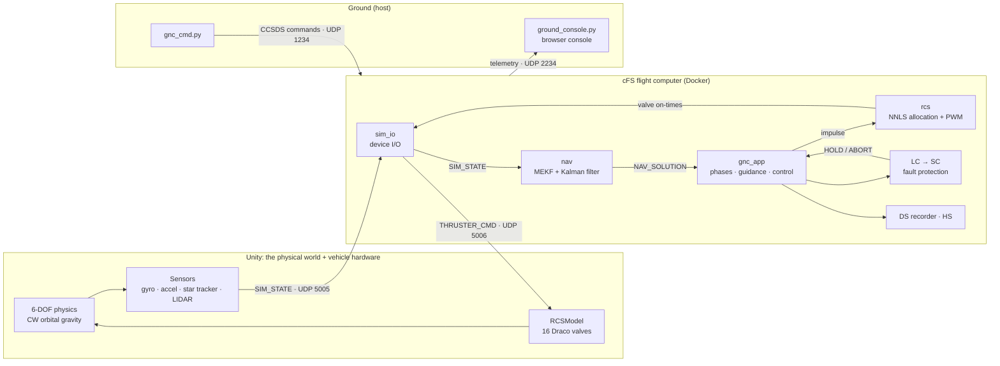

# cFS Spacecraft Docking Simulator

*A project by Jacob Thomsen*

A spacecraft rendezvous-and-docking simulator in which a Crew Dragon–style chaser docks to the International Space Station, flown by **real flight software** running on NASA's Core Flight System (cFS). Unity simulates the physical world and the vehicle's hardware; custom C flight apps inside cFS do the navigation, guidance, control, thruster selection, and fault protection; the two run in lock-step over a framed, CRC-checked UDP link.

The rule that governs everything: **Unity is only the physical world. All decision-making is flight software.** Unity produces noisy sensor readings and opens valves; cFS has to work out where it is, decide what to do, pick thrusters, and notice when something is wrong.

This is a learning project. Every design decision is made to mirror how real flight software works.  
*(Well also I don't have an orbital spacecraft available to me)*

> **Want the full tour?** [PROJECT_OVERVIEW.md](PROJECT_OVERVIEW.md) is the master guide to how every subsystem works. This README is the short version.

**Technologies used:**
- **C** — four custom cFS flight apps: `sim_io`, `nav`, `gnc_app`, `rcs`
- **NASA cFS / cFE 7 (Draco)** — Software Bus, scheduler, events, table manager, plus NASA's LC, SC, DS, and HS apps for fault protection, flight recording, and health monitoring
- **C#** — Unity scripts for 6-DOF physics, Clohessy-Wiltshire orbital mechanics, sensor models, RCS valves, and the SimLink interface
- **Python** — browser ground console, command uplink, flight-data-recorder decoder, and an end-to-end hardware-in-the-loop test harness (standard library only)
- **Unity 6** — physics simulation and scene rendering
- **Docker / WSL** — containerized cFS build and runtime environment
- **Blender** — tweaking 3D models of the International Space Station and SpaceX Crew Dragon capsule

---

## Real-World Context

Spacecraft rendezvous and proximity operations (RPOD) require a flight computer to read its sensors, estimate where it is, run a control law, fire thrusters, and protect the vehicle when something fails, all while being commanded and monitored from the ground. SpaceX Dragon, Boeing Starliner, and NASA Orion all follow this pattern on final approach to a station.

This project maps that architecture to accessible tools:

| Real Spacecraft | This Project |
|-----------------|--------------|
| Flight computer running an RTOS | Docker container running NASA cFS on Linux |
| Gyro, accelerometer, star tracker, docking LIDAR | `ChaserSensors.cs`: truth degraded with noise, bias, field of view, range limits, and dropouts |
| Avionics bus and device driver | SimLink protocol (sync word, sequence numbers, CRC-16) owned by one device-I/O app, `sim_io` |
| Onboard navigation filter | `nav`: attitude MEKF + 9-state translation Kalman filter |
| Thruster control electronics | `rcs` computes valve on-times; Unity's `RCSModel.cs` just opens and closes 16 valves |
| Onboard fault detection and response | LC (Limit Checker) watchpoints trigger SC (Stored Command) sequences: HOLD or a collision-avoidance ABORT |
| Flight data recorder | DS (Data Storage) recorder files, decoded on the ground by `tools/fdr_decode.py` |
| Onboard parameter tables (uplinked in-flight) | `CFE_TBL` tables with load-time validators for every gain, limit, noise model, and geometry value |
| Mission control | `ground_console.py` browser console + `gnc_cmd.py` CCSDS command uplink |
| Dragon hold-and-proceed waypoints | Autonomous hold points at 20 m and 3 m, released by GO |

Clohessy-Wiltshire differential gravity runs continuously in Unity, producing the relative-motion drift a real chaser experiences at ISS altitude (n = 0.00113 rad/s). Flight software uses the same equations in its navigation filter, its drift feed-forward, and its abort passive-safety check.

---

## System Architecture



Once every 0.2 s of simulation time:

1. Unity samples its sensors, sends one `SIM_STATE` frame, and **pauses its physics** until cFS answers.
2. `sim_io` validates the frame (sync, version, length, CRC) and publishes it on the Software Bus.
3. `nav` estimates attitude and relative position and velocity, and publishes a `NAV_SOLUTION`.
4. `gnc_app` runs its phase logic and control law and requests an impulse.
5. `rcs` decides which thrusters fire and for how long.
6. `sim_io` sends the valve on-times back to Unity, which fires them and resumes physics.

Because the arrival of `SIM_STATE` *is* the clock tick, runs are deterministic and repeatable, and a slow frame or a paused editor never desynchronizes the two sides. The round trip inside cFS typically takes under a millisecond.

---

## Components

### Flight software (cFS / C)

| App | Origin | Job |
|-----|--------|-----|
| `sim_io` | this project | The only app that touches sockets, like a 1553 or SpaceWire driver app. Validates SimLink frames, counts bad CRCs, sequence gaps, and stale answers |
| `nav` | this project | Attitude multiplicative EKF (with gyro-bias estimation) and a 9-state translation Kalman filter (CW dynamics, accelerometer bias). Fuses gyro, accelerometer, star tracker, and LIDAR range/bearing/pose. Chi-square gating, automatic re-initialisation, validity flags |
| `gnc_app` | this project | Phase state machine, docking-frame guidance, phase-plane attitude control, approach monitors, and the abort manoeuvre |
| `rcs` | this project | Non-negative least squares thruster allocation over its own thruster table, then pulse-width modulation with a 20 ms minimum impulse bit |
| LC / SC | NASA | Limit Checker decides when a measurement is a fault; Stored Command responds with the same GO/HOLD/ABORT commands an operator would send |
| DS / HS | NASA | Onboard flight-data recorder; health monitor that alerts if a flight app stops running |
| CI_LAB / TO_LAB / SCH_LAB | NASA samples | Command uplink, telemetry downlink, and 1 Hz housekeeping |

The navigation and allocation maths live in cFE-free files (`nav_filter.c`, `rcs_alloc.c`), so the exact flight code can also be compiled into test harnesses (see [Testing](#testing-and-verification)).

**GNC phases** (modelled on Dragon RPOD):

| Phase | What GNC does |
|-------|---------------|
| `IDLE` | Nothing fires. Boot state (guidance inhibited until GO), and after an abort manoeuvre |
| `CORRECT` | Holds range and drives the docking port onto the approach axis |
| `APPROACH` | Closes along the axis: 0.30 m/s cap before the 20 m hold point, 0.10 m/s after, never above 90 % of the approach envelope |
| `HOLD` | Station-keeps at the 20 m and 3 m hold points or on command; released by GO |
| `MANUAL` | Crew flies with the hand controllers (keyboard), with rate hold on the rotation stick |
| `DEPART` | Abort: retreats along the docking axis until the free drift is passively safe, then coasts to IDLE |
| `DOCKED` | Captured. Nothing fires |

If navigation isn't valid yet, GNC coasts in translation and keeps attitude control on the star tracker and gyro. Every phase change raises one EVS event; per-cycle state goes out as a `GNC_STATE` telemetry packet.

**Aborts are a manoeuvre, not a stop.** A chaser that just cuts thrust near a station can still drift into it. On ABORT, GNC backs away, then propagates its own state with the closed-form Clohessy-Wiltshire solution every cycle to confirm the free drift stays at least 10 m clear for a full orbit before it stops thrusting.

### Fault protection (measure → decide → act)

Flight apps only *measure* and publish counters; LC *decides* when a counter is a fault; SC *acts*. Every rule lives in a table, so it changes without touching flight code.

| Actionpoint | Fault | Response |
|-------------|-------|----------|
| AP0 | Sim link silent ≥ 2 s | ABORT |
| AP1 | Accelerometer sees < 50 % of the commanded thrust for 3 cycles | HOLD |
| AP2 | Navigation solution invalid on approach for 10 cycles | ABORT |
| AP3 | ≥ 5 LIDAR fixes rejected in a row | HOLD |
| AP4 | Closing faster than the approach envelope for 5 cycles | HOLD |
| AP5 | Outside the 15° approach cone inside 20 m for 5 cycles | ABORT |

After a response fires, its actionpoint goes passive; `gnc_cmd.py rearm` arms them all again.

### Unity simulation

Unity plays two roles: **the universe** and **the vehicle's hardware**.

- **Physics:** 12,000 kg chaser with a solid-cylinder inertia model, Clohessy-Wiltshire gravity every 20 ms physics step, 16 Draco thrusters (400 N, on/off) that each produce force *and* torque.
- **Sensors (`ChaserSensors.cs`):** reads truth from the physics engine and degrades it the way the real device would: gyro and accelerometer noise and bias, star tracker noise, LIDAR range/bearing noise with field-of-view and range limits, and a LIDAR pose solution inside 30 m. Noise is seeded so lock-stepped runs repeat exactly. Inspector toggles fail the IMU, star tracker, or LIDAR mid-run.
- **Capture:** `DockingDetector.cs` latches when the ports are within 5 cm axially, 10 cm laterally, closing at 0–0.30 m/s, and within 10° of cone and roll. The latch reaches flight software as a mechanism switch bit.
- **Truth stays on the Unity side.** `RelativeNav.cs` computes the exact relative state for the HUD only, so the HUD (truth) and the ground console (what flight software believes) can disagree. The gap between them is the navigation error.

The full byte layout of the Unity ⇄ cFS link (SimLink v5) is in [Docs/SIMLINK_ICD.md](Docs/SIMLINK_ICD.md). Every structure that crosses a boundary is mirrored in C, C#, and Python and size-checked at compile time.

### Ground segment

- **`ground_console.py`** — a browser console at http://localhost:8080 that decodes TO_LAB telemetry live: phase, range, closing speed, attitude errors, a navigation panel (filter status, sigmas, bias estimates, LIDAR accept/reject counts), an FDIR panel (each actionpoint armed/fired, fault streaks, predicted free-drift closest approach), the event log, and GO/HOLD/ABORT buttons. Every STATE packet is logged to `run_logs/` as CSV.
- **`gnc_cmd.py`** — CCSDS command uplink:

  | Command | Effect |
  |---------|--------|
  | `go` / `hold` / `abort` | Start or resume guidance / station-keep / collision-avoidance retreat |
  | `rearm` | Re-arm the fault-protection actionpoints (SC RTS 4) |
  | `nav-reset` | Re-initialise the navigation filter from the next LIDAR fix |
  | `trace-on` / `trace-off` | Per-cycle GNC debug line in the cFS console |
  | `noop` / `reset` | Heartbeat / zero housekeeping counters |

- **`tools/fdr_decode.py`** — splits DS flight-recorder files into per-packet CSVs (GNC state, NAV solution, valve commands, housekeeping) and an events log for post-run analysis.

---

## Testing and Verification

Testing runs in layers, from fast and narrow to slow and complete:

1. **Compile gates.** `-std=c99 -pedantic -Wall -Werror`; `_Static_assert` on every interface struct, so a layout mismatch can't build.
2. **NAV filter harness** (`cFS/apps/nav/unit-test/nav_filter_sim.c`). Runs `nav_filter.c` against a simulated truth model through five scenarios (long approach, close-in rotation, LIDAR dropout, teleport, star tracker outage) and reports accuracy and filter consistency.
3. **Monte Carlo** (`cFS/apps/gnc_app/unit-test/dock_mc.c`). Flies the *unmodified* flight sources (`gnc_app.c`, `nav_filter.c`, `rcs_alloc.c`) in closed loop against a 6-DOF truth model, with dispersed start states, sensor biases, thruster thrust and alignment, and mass properties. Pass/fail is graded on capture limits, or for abort runs, on never touching the station. `-p Name=value` overrides any GNC parameter for trade studies.
4. **End-to-end smoke test** (`tools/simlink_smoke.py`). A Python stand-in for Unity speaks SimLink to the **real cFS executable** (all apps, LC, SC, real tables) and runs 13 sequenced scenarios with automatic pass/fail: crew sticks, GO, ABORT, a corrupt frame, link loss, re-arm, and fault injection for dead thrusters, a failed IMU, a LIDAR jump, overspeed, and leaving the corridor. Every reply must echo its sequence number and pass CRC.
5. **Flight test.** Unity + cFS + ground console, flown by hand.

**Monte Carlo results** (200 docking + 100 abort runs), before and after realism phase 5:

| Metric | Before | After |
|--------|--------|-------|
| Capture success | 100 % | 100 % |
| Contact lateral offset (limit 10 cm) | 5.2 cm mean, 9.2 cm worst | **1.0 cm mean, 2.3 cm worst** |
| Propellant per docking | 19.3 kg | **11.1 kg** |
| Aborts that stay clear of the station | **68 %** | **100 %** |

---

## The Realism Overhaul

The project started with Unity doing most of the flight software's job: computing navigation from truth, choosing thrusters, raising mode flags. A design review on 2026-09-26 set out to move every one of those jobs into cFS, one phase at a time, each phase flight-tested before the next.

| Phase | Before | After |
|-------|--------|-------|
| **1 — Lock-step** | GNC ran on a wall-clock timer; plain UDP structs | Simulation time is the clock; framed, CRC-checked, sequence-numbered SimLink; `sim_io` owns the sockets |
| **2 — Actuators** | Unity allocated thrusters; GNC sent a wrench | GNC requests an impulse; `rcs` allocates (NNLS) and pulse-modulates; Unity just opens valves; keyboard flies through cFS |
| **3 — Fault protection** | Auto-abort hard-coded in GNC | Measure in GNC → decide in LC → act in SC; DS flight recorder; HS; ground console FDIR panel |
| **4a — Navigation** | Unity sent range and attitude errors from truth | Unity sends raw sensor readings; `nav` estimates everything |
| **4b — Better navigation** | Raw star tracker attitude; no bias handling | Attitude MEKF with gyro bias; accelerometer bias; LIDAR pose; NAV fault responses |
| **5 — Guidance & control** | ABORT coasted (32 % hit the station) | Collision-avoidance manoeuvre with passive-safety check; docking-frame commands; phase-plane attitude; approach envelope; Monte Carlo-tuned gains |

---

## Getting Started

### Prerequisites

| Tool | Purpose |
|------|---------|
| Docker Desktop | Runs the cFS build and runtime environment |
| WSL 2 (Ubuntu) | Windows only: the run scripts build inside WSL for speed |
| Unity 6 | Runs the physics simulation |
| Python 3 | Ground console, command uplink, and test tools (standard library only) |

No external Unity packages.

### 1. Clone with submodules

```bash
git clone --recurse-submodules https://github.com/JayyCub/cFS_Project.git
cd cFS_Project
```

### 2. Build and run cFS

```bash
./run-sim.sh
```

This syncs the source into WSL, builds inside the Docker container, starts `core-cpu1`, and logs the whole run to `run_logs/`. (On macOS or Linux, run `./cfs-dev.sh`, then `make native_std.install` and `./core-cpu1` from `build-native_std/exe/cpu1`.)

Look for each app's startup event, for example:

```
SIM_IO initialized: SimLink v5, rx port 5005, ...
NAV initialized: attitude MEKF + CW Kalman filter (IMU, star tracker, LIDAR), ...
RCS initialized: NNLS allocation + PWM over table ...
GNC_APP initialized (lock-step on NAV_SOLUTION). ...
```

### 3. Start the ground console

```bash
python3 ground_console.py
```

Open http://localhost:8080. If no telemetry appears, press `t` to enable the TO_LAB downlink.

### 4. Start Unity

Open `cFS_DockingSim/` in the Unity Editor and press **Play** on **Scene2**. Wait for `lock-step ENGAGED` in the Unity console, then for the console's NAV panel to read **VALID** (a few seconds).

### 5. Fly

Press **GO** on the console (or `python3 gnc_cmd.py go`). GNC corrects onto the axis, approaches, stops at the 20 m and 3 m hold points (press GO at each), and docks. Touching the keyboard hands control to the crew (MANUAL); GO gives it back.

### 6. Break something

- Pause Unity for more than 4 s: link loss → retreat.
- Tick **Fault injection → imuFailed** on `ChaserSensors` during approach: navigation is lost → retreat.
- Then send `rearm` and `go`.

For the full operations guide, events, and troubleshooting, see [Docs/OPERATIONS.md](Docs/OPERATIONS.md).

---

## Documentation

| Document | Contents |
|----------|----------|
| [PROJECT_OVERVIEW.md](PROJECT_OVERVIEW.md) | The master guide: architecture, design patterns, every subsystem, testing, and history |
| [Docs/OPERATIONS.md](Docs/OPERATIONS.md) | How to run it, commands, events, troubleshooting |
| [Docs/DEV_REFERENCE.md](Docs/DEV_REFERENCE.md) | Control-law detail, parameters, and "how do I change X" recipes |
| [Docs/SIMLINK_ICD.md](Docs/SIMLINK_ICD.md) | The Unity ⇄ cFS interface, byte by byte |
| [Docs/RCS_THRUSTER_REFERENCE.md](Docs/RCS_THRUSTER_REFERENCE.md) | Per-thruster geometry |
| [Docs/PROJECT.md](Docs/PROJECT.md) | Original design reference and early build history |
| [Docs/ATTITUDE_AUTOPILOT_GUIDE.md](Docs/ATTITUDE_AUTOPILOT_GUIDE.md) | Retrospective learning guide for the original attitude controller |

---

## Repository Layout

```
cFS_Project/
├── README.md / PROJECT_OVERVIEW.md   ← start here
├── Docs/                             ← operations, dev reference, ICD, thruster reference
├── run-sim.sh                        ← sync to WSL, build, and run cFS (logs to run_logs/)
├── wsl-dev.sh / sync-to-wsl.sh       ← WSL dev container helpers
├── cfs-dev.sh / Dockerfile           ← Docker dev container
├── ground_console.py + console.html  ← browser ground console
├── gnc_cmd.py                        ← command uplink
├── tools/
│   ├── simlink_smoke.py              ← end-to-end HIL test (Unity stand-in)
│   └── fdr_decode.py                 ← flight-data recorder → CSV
├── cFS/                              ← NASA cFS (git submodule)
│   ├── apps/
│   │   ├── sim_io/                   ← device I/O; simlink_icd.h is the C interface
│   │   ├── nav/                      ← navigation; nav_filter.c + unit-test/ harness
│   │   ├── gnc_app/                  ← guidance & control; unit-test/ Monte Carlo
│   │   ├── rcs/                      ← thruster allocation + PWM
│   │   └── lc, sc, ds, hs, ...       ← NASA apps
│   └── sample_defs/                  ← app lineup, LC/SC/DS/HS and TO_LAB/SCH_LAB tables
└── cFS_DockingSim/Assets/            ← Unity project
    ├── SimLinkProtocol.cs            ← C# interface (mirrors simlink_icd.h)
    ├── UdpTelemetrySender.cs         ← lock-step master
    ├── UdpCommandReceiver.cs         ← valve-command receiver
    ├── ChaserSensors.cs              ← sensor models
    ├── RCSModel.cs                   ← thruster valves
    ├── HandController.cs             ← crew hand controllers
    ├── ClohessyWiltshire.cs          ← orbital gravity
    ├── VehicleState.cs               ← rigid-body wrapper, inertia
    ├── DockingDetector.cs, SoftCaptureController.cs, DockingContactConstraint.cs  ← capture
    ├── RelativeNav.cs                ← truth (HUD only)
    └── UI, cameras, plumes, diagnostics
```

---

## What's Next

**Phase 6: Unity physics realism.** Make the physical world as honest as the flight software: spring-damper contact and a real capture sequence, inertia products and centre-of-mass shift, ISS attitude motion, thruster valve dynamics and failure injection, and propellant use. Also on the list: an undocking phase (DOCKED is currently terminal) and UT-Assert unit tests for the cFS apps.

---

## Journal

Progress snapshots as the project develops.

**Unity scene with Crew Dragon and ISS models**


**Blender shading work on the vehicle models**
I was able to import Kerbal Space Program models into Blender instead of creating 3D models from scratch. However, there was plenty of issues to still fix. For example, it took a while to figure out why part of the ship was completely chrome. Turns out a value in the shading configuration was set to max.


Also next I need to figure out why my shading and surfaces didn't transfer to Unity.

**June 8th Update**
I think I finally fixed my git history and am now using Git LFS for large files.

The scene in Unity looks a lot better now with materials and textures (mostly) correctly added in


**June 23rd Update: RCS Plumes and Multi-Camera System**

I was getting tired of math and deep issues with GNC so I just went for two big visual and usability improvements.

First, proper RCS thruster plumes. Each of the 16 Draco thrusters now emits a particle-based exhaust plume driven live from the throttle state, plus a mesh-based glow cone that fades in and out smoothly when a thruster fires or cuts off. The thruster model was also updated to be physically accurate — Draco thrusters are binary (on/off at full thrust), so the pseudo-inverse allocator now snaps outputs to either full power or zero rather than fractional levels. Torque cancellation that was previously handled by proportional throttles is now left to the rate damping controller, which is more representative of how real Dragon GNC works.

Second, a multi-camera system. The sim now has four switchable cameras: the original nose/docking cam (key `1`), two manually-placed ISS robotic cameras that can pan and zoom (keys `2` and `3`), and a third-person chase cam that smoothly follows Dragon from behind (key `4`). A small HUD in the corner always shows which camera is active. The screenshot below is the ISS approach camera looking out at Dragon on final approach with plumes firing.


**July 21st Update: Dual-Mode Stream/Utility UI**

Replaced the old IMGUI debug overlay with a proper Canvas-based HUD with two modes. Stream mode is the compact overlay meant for recording — just the essentials plus a thruster-firing ring. Utility mode is for actually debugging a run: three collapsible slide-out panels (positional/attitude data with per-axis roll/pitch/yaw gauges, a detailed thruster-firing diagram, and a raw command/condition debug panel), each tucked out of the way behind a pull-tab when you don't need it.

CORRECT phase, 25.82 m out, station-keeping axially while killing lateral drift:


APPROACH phase, 5.34 m out, corridor confirmed:


APPROACH phase, 2.91 m out, final closure with attitude gauges in frame:


DOCKED:


**August 29th Update: UI Toolkit Rewrite**

Spent today ripping out the Canvas-based HUD from the July 21st update and rebuilding it on Unity's UI Toolkit (UXML/USS) instead of hand-built RectTransform hierarchies constructed line-by-line in C#. Layout, colors, and spacing now live in stylesheet files that can be tweaked directly — including live in the Editor's UI Builder — without touching C# or recompiling. Also simplified the dual-mode Stream/Utility toggle down to a single always-visible layout, swapped the attitude gauges for plain roll/pitch/yaw + rate-of-change readouts, and moved the debug panel's show/hide from an on-screen tab to a keyboard shortcut (F3) after its position kept fighting the slide-out animation.

Also landed a scripted docking-alignment funnel (`DockingContactConstraint.cs`) that replaces real mesh contact between the chaser petals and the station port during final approach — removes the "glitching away" instability from convex-hull-vs-concave-mesh contact while still camming a slightly misaligned ship into alignment as it seats.

APPROACH phase, 2.99 m out, looking through the docking ring at Columbus with the rebuilt HUD:


APPROACH phase, 3.83 m out, RCS thrusters firing on final approach:


**September 26th – October 4th: The Realism Overhaul**

Up to this point, Unity was quietly doing a lot of the flight software's job: it computed navigation from perfect truth, picked which thrusters to fire, and raised the mode flags. Over five phases I moved every one of those jobs into cFS. Unity now only produces noisy sensor readings and opens valves, and the flight software has to navigate with Kalman filters, allocate its own thrusters, and protect itself with NASA's Limit Checker and Stored Command apps. Along the way I built a Python test harness that stands in for Unity against the real cFS executable, and a Monte Carlo harness that flies the flight code hundreds of times. The Monte Carlo found that 32 % of aborts drifted back into the station, so ABORT is now a real collision-avoidance manoeuvre, and 100 % of aborts stay clear. See [The Realism Overhaul](#the-realism-overhaul) and [PROJECT_OVERVIEW.md](PROJECT_OVERVIEW.md) for the details.
